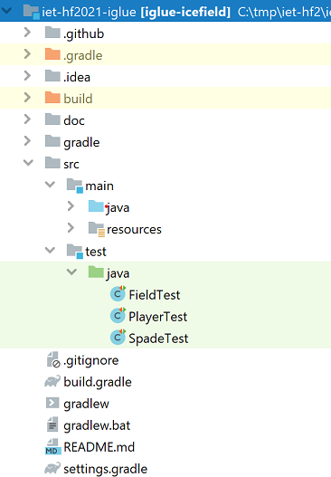
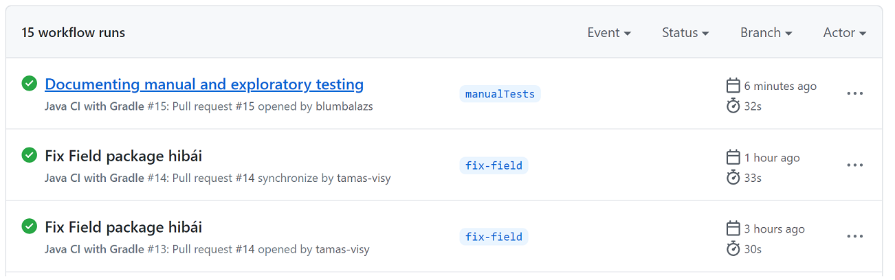

# Build keretrendszer és CI beüzemelése

## Build keretrendszer beüzemelése

Build keretrendszernek **Gradle**-t választottam. A projektet az ehhez szükséges Gradle fájlokkal konfiguráltam, valamint új projektstruktúrát hoztam létre. A projektstruktúra forráskód szinten két nagy csoportra különül el: *forráskódra* és *tesztekre*.
Forráskód szinten készítettem egy dedikált mappát az erőforrásoknak *(resources)*, mely a grafikus megjelenítésért képeket ide szerveztem.
A *.gitignore* fájl tartalmát is módosítottam, hogy a lokálisan létrejövő *.gradle* mappa és a buildeléskor előálló fájlok ne legyenek verziókövetve. Véletlenül a sonarlint által generált fajlokat is feltöltöttem, ezt később javítottam és a kizárást hozzáadtam a fájlhoz.

   
  <i>1. ábra: Projektstruktúra</i>

## CI beüzemelése

**Github Actions** kiinduló felületén a meglévő sablonok segítségével készítettem el a *.github/workflows/gradle.yml* fájlt. 
Githubon a futtatás Linux-on történik, a gradlew build során a buildelés során a test mappában lévő tesztek is végrehajtásra kerülnek, a tesztek sikertelenségéről(amennyiben van ilyen) a **CI** visszajelzést ad, melyet az Actions tabon, vagy a pull requestben tudunk figyelemmel követni.

   
  <i>2. ábra: CI a Github Actions tabon</i>

## CI tesztek

Teszteket készítettem **Mockito** keretrendszer segítségével a CI működésének bizonyítására. Felvettem a függőségeket a *build.gradle*-ben *(junit, mockito)*. 5 tesztet készítettem, a játék fő alkotóelemeiből tesztelek egy-egy apró szegmenst: játékos lépése mezőkön haladása, munkaegységének ellenörzése, vízbesesése, item-ek felvétele, valamint az asó használatával kapcsolatos munkaegység és hócsökkentésének a vizsgálata. Ehhez kapcsolódik három fájl: *PlayerTest.java, FieldTest.java, SpadeTest.java*.
Ami itt meglepetésképp ért, hogy gépemen Intellij Idea-ban, valamint a parancssoros gradle-t futtatva tesztek végeredménye sikeres volt, viszont a CI nem találta meg, a tesztekben hivatkozott (importált) osztályokat. Ennek az oka hosszas fejtörés után, az volt hogy a Main mappa nagybetűvel szerepelt, Linuxon ez problémás(casesensitive). Javítottam a hibát innen minden sikeresen ment.