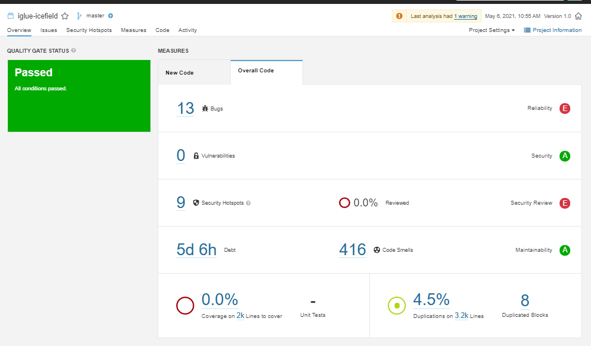

# Manuális kód átvizsgálás és statikus analízis eszköz futtatása

## Manuális kód átvizsgálás

A kódot átolvastuk, és kigyűjtöttük az észrevett hibákat, illetve az inkonzisztens elnevezéseket.

## Statikus analízis

A statikus ananlízis elvégzésére SonarQube-ot és SonarLint-t használtunk. A projekt elején a SonarQube ezeket az értékeket mondta a projektről:

Látszik, hogy van egy pár bug, security hotspot és code smell is a projektben. Javítások elvégzése után a következő eredményeket kaptuk:

Sikerült egy pár bug-ot és rengeteg code smell-t is kijavítani. A maradék bug és security hotspot egy jelentős része az eredeti projekt "tesztjeiben" található, és mi próbáltuk elsődlegesen inkább a tényleges program hibáit javítani. A security hotspot-ok fele a Random-ra vonatkoznak, ezt 1 helyen kicseréltük SecureRandomra, a többi helyen meghagytuk a sima Randomot, mert inkább különböző hibákat szerettünk volna javítani és nem ugyanazt a hibát rengeteg helyen.

## Elvégzett javítások

### Game package

Ebben a package-ben többféle hiba is akadt, amit javítottunk.
A "legérdekesebb" egy nagyon hosszú függvény részekre bontása volt, de sok idő elment kisebb hibák javításával is.

### Field package

Itt is akadt sok kisebb hiba, ezek egy részét javítottuk. A BDD tesztek készítése során felfedeztünk egy ide 
tartozó bugot, amit sikeresen javítottunk.

### Item package

Találtunk pár felesleges változót, nem szép kódot, ezeket kijavítottuk. A BDD teszteknek köszönhetően észrevettünk egy hibát az egyik függvény if feltételében, ezt kijavítottuk.

### Player package

Itt találtunk pár inkonzisztenciát a szinkronizációban, duplikált függvényt és nem egyértelmű neveket, ezeket kijavítottunk. Illetve volt pár felesleges változó, amiket töröltünk.